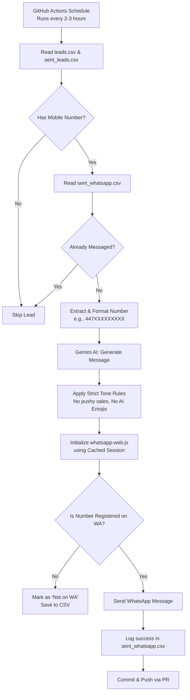

# Phase 4: WhatsApp Automation Plan

## 1. Core Philosophy & Isolation
- **Rule 1: Zero Impact on Email Campaign.** The existing email campaign (`src/outreach`) and its GitHub Action (`outreach.yml`) must **NOT** be modified, stopped, or affected in any way.
- **Rule 2: Complete Separation.** All WhatsApp logic will live in a dedicated folder (`src/whatsapp/`) and will have its own separate GitHub Action (`.github/workflows/whatsapp.yml`).
- **Rule 3: Local Dry-Runs First.** Before any code is merged, we will rigorously test the string parsing, number formatting, AI prompt, and authentication locally to prevent CI crashes or sending spam.

---

## 2. Technical Stack
- **Library:** `whatsapp-web.js` (A robust Puppeteer-based WhatsApp client for Node.js).
- **Authentication:** WhatsApp requires a QR code scan. We will create a local `setup.js` script. The user runs this locally, scans the QR code, and it generates a session token to store in GitHub Secrets for headless CI execution.
- **Data Source:** The WhatsApp script will scan both `leads.csv` (for phone-only leads) AND `sent_leads.csv` (for leads that already got an email).
- **AI Integration:** Google Gemini will craft the message dynamically.

---

## 3. Workflow Architecture (Graph)

---

## 4. Anticipated Edge Cases & Defensive Solutions

| Potential Problem | Why it happens | Our Defensive Solution |
| :--- | :--- | :--- |
| **WhatsApp Account Ban** | Sending too many messages quickly triggers WhatsApp's spam filters and bans the number. | 1. Limit to max **10-15 messages per day**. 2. Run CI only every 2-3 hours to drip messages slowly. |
| **"AI-Bot" Tone & Emojis** | AI natively uses generic emojis (🚀, 🎉, 👋) and pushy sales language ("Let's have a 2-min chat"). | **Strict Prompting:** We will explicitly instruct the AI to write like a human on a phone. **No generic emojis**, no aggressive selling. The message will be a soft, value-driven intro (e.g., leaving a portfolio link for future reference). |
| **Missing Rows/Conflicts** | The Email Bot moves rows from `leads.csv` to `sent_leads.csv`. If WhatsApp Bot only reads `leads.csv`, it misses valid leads! | The WhatsApp Bot will read **BOTH** `leads.csv` and `sent_leads.csv`, but maintain its own tracking file (`sent_whatsapp.csv`) to prevent duplicate texting. |
| **Garbage Phone Numbers** | A company might have landlines (`020...`) or junk data. | We will run a strict regex (`^07\d{9}$` or `^447\d{9}$`) and ONLY extract the **FIRST valid UK mobile number**. |
| **Formatting Crash** | WhatsApp API strictly requires numbers in international format (`447...`) without the `+`. | We will write a dedicated normalizer function with unit tests to ensure all UK formats convert to exactly `447...`. |

---

## 5. Granular Step-by-Step Implementation Strategy

### Unit 4.1: Data Preparation & CSV Tracking
- **Create** `src/whatsapp/csv.js`.
- **Logic:** Write functions to read `leads.csv` and `sent_leads.csv`, extract valid mobile numbers, and cross-reference them against a new file `sent_whatsapp.csv`.
- **Test:** Write automated tests to ensure commas and quotes in CSVs don't break the parser, and that it safely handles empty/missing files.

### Unit 4.2: Number Formatting & Validation
- **Create** `src/whatsapp/format.js`.
- **Logic:** Function that takes any string, strips spaces, checks if it's a UK mobile (`07` or `447`), and outputs a clean WhatsApp ID string (e.g., `447123456789@c.us`).
- **Test:** Write strict tests passing landlines (should fail), wrong numbers (should fail), and valid numbers (should pass).

### Unit 4.3: The "Anti-Spam" AI Prompt
- **Create** `src/whatsapp/ai.js`.
- **Logic:** Connect to Gemini. Write the prompt heavily emphasizing the **Soft-Sell / Human Tone** rule. Ensure no generic AI emojis are allowed.
- **Test:** Run mock generations locally to verify the tone is natural and non-pushy.

### Unit 4.4: WhatsApp Client Setup (Local Auth)
- **Create** `src/whatsapp/setup.js`.
- **Logic:** A local-only script that opens a headless browser, displays a QR code in the terminal, and waits for the user to scan. It then saves the `.wwebjs_cache` directory.
- **Action:** User will run this script once to link their phone.

### Unit 4.5: The Messaging Bot
- **Create** `src/whatsapp/bot.js`.
- **Logic:** Combine Unit 4.1 to 4.4. The bot will load the session, fetch ONE pending lead, check if they are registered on WhatsApp using `client.isRegisteredUser()`, send the AI message, and append to `sent_whatsapp.csv`.

### Unit 4.6: GitHub Actions Pipeline
- **Create** `.github/workflows/whatsapp.yml`.
- **Logic:** Set a schedule (e.g., `0 */3 * * *` for every 3 hours). The action will restore the WhatsApp cache, run the bot, and create an auto-merging PR to save `sent_whatsapp.csv`.
